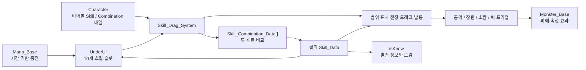

# 위대한 마법사 (Great Magician)

> 4개 원소의 하위 마법을 조합해 상위 마법을 발견하고, 벽 너머 전장에 배치해 웨이브를 막는 모바일 디펜스 프로토타입입니다.

[플레이 영상](https://youtu.be/2Y6_XasJd3w) · [상세 기술 기록](https://app.notion.com/p/753f1fce5d168310a62401fc134f35d7) · [포트폴리오](https://hwang-doyeon-game-dev.hwangdy135.chatgpt.site)

<table>
  <tr>
    <td></td>
    <td></td>
  </tr>
  <tr>
    <td align="center">웨이브 전투</td>
    <td align="center">마법 관리와 강화</td>
  </tr>
  <tr>
    <td></td>
    <td></td>
  </tr>
  <tr>
    <td align="center">조합 도감</td>
    <td align="center">초기 웨이브 방어</td>
  </tr>
</table>

## 프로젝트 개요

| 항목 | 내용 |
|---|---|
| 개발 기록 | 2024년 · 약 12개월 (포트폴리오 기록) |
| 공개 Git 이력 | 2025.06.03–2025.12.07 · 73 commits |
| 개발 형태 | 1인 개발 · 개인 기여도 100% |
| 장르 / 플랫폼 | 웨이브 디펜스·스킬 조합 / Android |
| 엔진 / 언어 | Unity 2022.3.62f2 / C# / ScriptableObject |
| 현재 상태 | Unity 2022 프로토타입 개발 중단 · Unity 6 기반 재설계 계획 |

기획, 전투·스킬 시스템, 데이터 입력, UI 연결, Android 실기기 검증을 혼자 진행했습니다. 공개 저장소의 73개 커밋도 한 명의 작성자로 확인됩니다. 아래에서는 현재 저장소에서 확인 가능한 구현과 아직 실행하지 않은 재설계 계획을 구분합니다.

## 핵심 플레이 흐름

**마나 자동 충전 → 기본 마법 획득 → 같은 티어 마법 조합 → 전장에 드래그해 사용 → 웨이브 방어 → 보상과 영구 성장**

- 0티어는 불·물·땅·바람 4개 원소로 시작합니다.
- 조합으로 1티어 10종과 2티어 55종을 발견합니다.
- 스토리 모드는 짧은 스테이지 방어, 무한 모드는 저장·이어하기를 포함한 장기 방어를 목표로 했습니다.
- 획득한 스킬과 재화를 사용해 마법·캐릭터·방벽 능력치를 강화합니다.

## 현재 프로토타입 구조



## 구현 포인트

### 1. 순서에 무관한 마법 조합과 발견 정보

`Skill_Combination_Data`는 두 재료를 정방향과 역방향으로 비교해 `불 + 물`과 `물 + 불`을 같은 조합으로 처리합니다. 드래그 중 다른 슬롯과 겹치면 등록된 조합을 탐색하고, 성공 시 한 슬롯을 결과 스킬로 교체하고 다른 슬롯을 비웁니다. 처음 발견한 결과는 `isKnow` 상태를 갱신해 도감과 안내 UI에 공개합니다.

저장소에 등록된 실제 데이터는 다음과 같습니다.

| 티어 | 스킬 데이터 | 조합 데이터 | 상태 |
|---|---:|---:|---|
| 0티어 | 4개 | - | 구현 |
| 1티어 | 10개 | 10개 | 구현 |
| 2티어 | 55개 | 55개 | 구현 |
| 3티어 | 210개 목표 | - | 기획 단계 · 미구현 |

근거: [`Skill_Combination_Data`](https://github.com/doyeon-SM/GreatMagicianProject/blob/main/Assets/Scripts/Skill_CS/Skill_Combination_Data.cs#L5-L17) · [`조합 탐색과 적용`](https://github.com/doyeon-SM/GreatMagicianProject/blob/main/Assets/Scripts/Skill_CS/Skill_Drag_System.cs#L774-L833) · [`스킬 데이터 폴더`](https://github.com/doyeon-SM/GreatMagicianProject/tree/main/Assets/Skill/ScriptableObjects)

### 2. 데이터에서 전투 실행까지 연결

`Skill_Data`에 공격력, 티어, 아이콘, 범위·공격 프리팹, 스킬 타입, 효과, 속성을 정의했습니다. 발동 시 몬스터 속성과 비교해 유리 속성은 1.5배, 불리 속성은 0.5배 피해를 적용하고, 넉백·빙결·마비·화상·공포·중력·독 같은 효과를 실행합니다.

투사체, 연쇄, 범위, 직선, 설치, 산탄, 소환, 회전형으로 실행 타입을 나눠 하나의 전투 루프에서 다양한 마법 표현을 연결했습니다.

근거: [`Skill_Data 정의`](https://github.com/doyeon-SM/GreatMagicianProject/blob/main/Assets/Scripts/Skill_CS/Skill_Data.cs#L5-L68) · [`속성 피해`](https://github.com/doyeon-SM/GreatMagicianProject/blob/main/Assets/Scripts/Skill_CS/Skill_Data.cs#L86-L120) · [`효과 실행`](https://github.com/doyeon-SM/GreatMagicianProject/blob/main/Assets/Scripts/Skill_CS/Skill_Data.cs#L147-L179)

### 3. 장기 진행 저장

`Application.persistentDataPath/save.json`에 캐릭터 레벨·경험치·방벽·마나·재화와 69개 스킬의 공격력·레벨·강화 비용·발견 여부를 저장합니다. 스토리 진행, 퀘스트 상태, 튜토리얼 확인 정보도 같은 저장 흐름에서 복원합니다.

근거: [`SaveSystem 저장`](https://github.com/doyeon-SM/GreatMagicianProject/blob/main/Assets/Scripts/BuildSetting/SaveSystem.cs#L46-L143) · [`SaveSystem 불러오기`](https://github.com/doyeon-SM/GreatMagicianProject/blob/main/Assets/Scripts/BuildSetting/SaveSystem.cs#L146-L241)

## 저장소에서 확인한 구현 범위

기준: 기본 브랜치 `HEAD` (`23fac30`)

| 항목 | 확인 결과 |
|---|---:|
| 커밋 / 작성자 | 73 commits / 단독 커미터 |
| C# 스크립트 | 72개 |
| 구현 스킬 데이터 | 69개 · 0티어 4 + 1티어 10 + 2티어 55 |
| 조합 데이터 | 65개 · 1티어 10 + 2티어 55 |
| 활성 빌드 씬 | 8개 |
| 실행 검증 | Android 실기기 실행 완료 (포트폴리오 기록) |

## 구조 진단과 다음 설계

현재 프로토타입은 핵심 루프를 빠르게 확인하는 데 초점을 맞춰 다음 책임이 한곳에 모여 있습니다.

- `Skill_Data`가 정적 데이터와 전투 실행 로직을 함께 보유합니다.
- 1,048줄의 `Skill_Drag_System`이 마우스·터치 입력, 조합 탐색, 범위 표시, 발동, 시간 감속, 발견 UI를 함께 처리합니다.
- 조합은 등록된 목록을 순회해 찾으므로 현재 65개에서는 단순하지만, 3티어 210개를 더하면 작성·검증 비용이 커집니다.

따라서 Unity 6 재설계에서는 `SkillDefinition`, `CombinationResolver`, 실행 전략, 슬롯 상태, 입력과 표시 UI를 분리하고, **0티어 획득 → 1티어 조합 → 드래그 사용 → 단일 웨이브 클리어**만 포함한 MVP부터 다시 검증할 계획입니다. 이 구조는 목표이며 현재 저장소에 구현 완료된 것으로 간주하지 않습니다.

## 실행 방법

```bash
git clone https://github.com/doyeon-SM/GreatMagicianProject.git
```

1. Unity Hub에서 저장소 루트를 프로젝트로 추가합니다.
2. [`ProjectVersion.txt`](https://github.com/doyeon-SM/GreatMagicianProject/blob/main/ProjectSettings/ProjectVersion.txt)에 맞춰 **Unity 2022.3.62f2**로 엽니다.
3. [`Assets/Scenes/Loby.unity`](https://github.com/doyeon-SM/GreatMagicianProject/blob/main/Assets/Scenes/Loby.unity)을 열고 Play를 실행합니다.

`Loby`가 첫 활성 씬이며 총 8개 씬이 빌드 목록에 등록된 것은 [`EditorBuildSettings.asset`](https://github.com/doyeon-SM/GreatMagicianProject/blob/main/ProjectSettings/EditorBuildSettings.asset#L7-L31)에서 확인할 수 있습니다. 저장소에는 별도 배포 APK가 없으므로 Android 빌드에는 Unity Hub의 Android Build Support가 필요합니다.

## 현재 한계

- 핵심 전투 루프는 플레이할 수 있지만 전체 게임은 프로토타입 단계이며, 3티어·연구·타일 해금·일부 옵션은 미완성입니다.
- 전용 그래픽·아이콘·타격 연출과 UI 완성도가 출시 품질에 도달하지 않았습니다.
- 프로젝트 전용 자동화 테스트 코드는 저장소에서 확인되지 않아 조합과 저장 호환성을 수동으로 회귀 검증해야 합니다.
- 2027년 Google Play 출시는 목표일 뿐 완료된 결과가 아닙니다.
